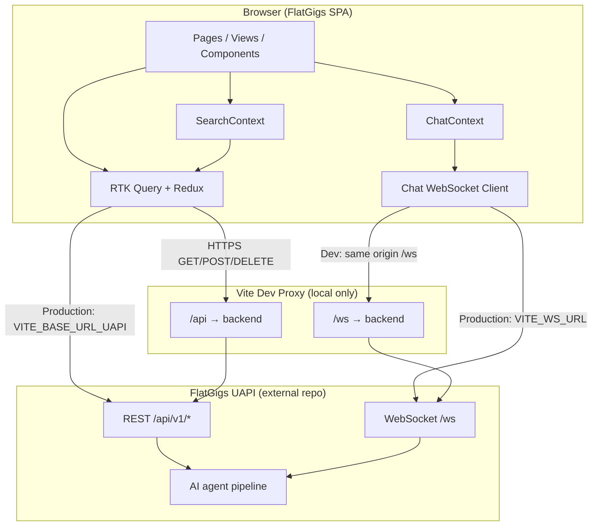
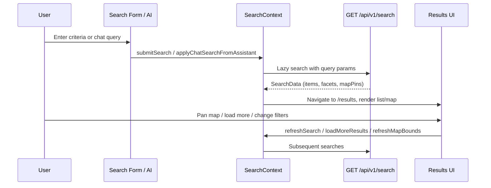
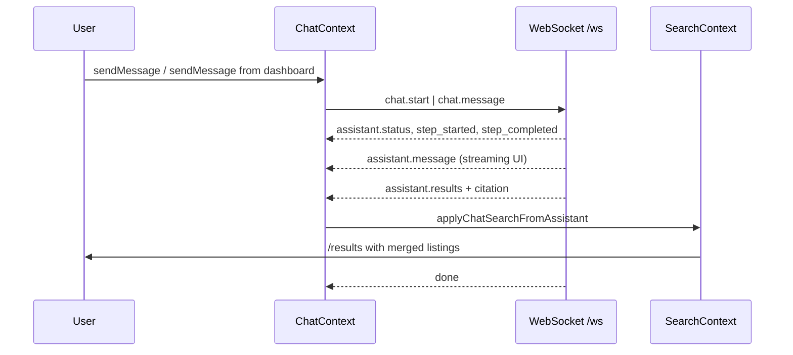

# FlatGigs Frontend

Production-grade React SPA for **FlatGigs** — an AI-native travel discovery and booking experience. Users search stays with traditional filters or natural language, explore results on a map or list, inspect listing details, save favorites, compare properties side-by-side, and interact with a multi-agent AI concierge over WebSocket.

This repository contains the **frontend only**. It communicates with a separate backend UAPI service over REST and WebSocket.

---

## Table of Contents

1. [Project Overview](#1-project-overview)
2. [Architecture Overview](#2-architecture-overview)
3. [Technology Stack](#3-technology-stack)
4. [Getting Started](#4-getting-started)
5. [Running the Project](#5-running-the-project)
6. [Folder Structure](#6-folder-structure)
7. [Core Features](#7-core-features)
8. [Application Flow](#8-application-flow)
9. [API Overview](#9-api-overview)
10. [Development Guidelines](#10-development-guidelines)
11. [Deployment](#11-deployment)
12. [Troubleshooting](#12-troubleshooting)
13. [Future Improvements](#13-future-improvements)

---

## 1. Project Overview

### What it does

FlatGigs combines a **Booking.com-style product surface** (search, filters, map, listing pages, reviews, calendars, price quotes) with an **AI travel concierge** that understands natural-language trip requests, runs multi-step agent workflows, and returns ranked stays with citations and rationale.

### Business purpose

Travel search is fragmented: users bounce between tabs, filters, maps, and review pages. FlatGigs reduces that friction by letting users describe what they want in plain language while keeping full control through traditional filters — so discovery feels conversational but booking UX stays familiar and trustworthy.

### Core use cases

| Use case | Description |
| --- | --- |
| Traditional search | Search by city, dates, and guests; refine with price, rating, property type, amenities, and sort. |
| Map exploration | Browse clustered price markers; pan/zoom triggers bounds-based re-search; list and map stay in sync. |
| AI concierge | Ask for stays in natural language from the dashboard or chat drawer; agent steps and citations are visible in real time. |
| Listing evaluation | View gallery, amenities, neighbourhood map, aspect scores, filtered reviews, availability calendar, and price breakdown. |
| Wishlist | Save and manage favorite listings server-side (session-scoped). |
| Compare | Select up to 3 listings locally, then request an AI verdict comparing price, amenities, and review signals. |

### Target users

- **Travelers** looking for short-term stays with smarter discovery than keyword-only search.
- **Product and engineering teams** evaluating AI-augmented booking UX patterns.
- **Stakeholders** reviewing a deployable slice of an AI-native travel platform.

There is **no user authentication** in the current product — sessions are anonymous and scoped per browser tab.

---

## 2. Architecture Overview

### High-level design

The app is a **client-rendered SPA** built with Vite and React. State is split deliberately:

| Layer | Responsibility |
| --- | --- |
| **RTK Query** (`src/store/`) | Server data: search, listings, wishlist, compare. Caching, invalidation, optimistic updates. |
| **React Context** (`src/context/`) | Cross-route UI state: search inputs/results, chat/WebSocket session, map hover/sync, listing detail scope. |
| **Redux slice + persist** | Client-only compare basket (localStorage). |
| **Pages + Views** | Route shells (`pages/`) compose providers; feature UI lives in `views/`. |
| **Atomic components** | Reusable UI in `atoms/`, `molecules/`, `organisms/`. |

### System diagram



### Communication flow

1. **Bootstrap** — `main.tsx` mounts `App` with Redux, persistence, MUI theme, and React Router.
2. **Layout** — `RootLayout` wraps all routes with `SearchProvider`, `ChatProvider`, header, compare FAB, and chat drawer.
3. **Search** — Form or AI results update `SearchContext`, which calls `useLazySearchQuery` → `GET /api/v1/search`.
4. **Chat** — User messages go over WebSocket (`chat.start`, `chat.message`); server streams agent status, messages, results, and citations; successful searches hydrate `SearchContext` and navigate to `/results`.
5. **Listing detail** — Route param `:id` drives `ListingDetailProvider` → RTK Query listing, calendar, quote, and reviews endpoints.

### Data flow (search example)

```
User input (form or chat)
  → SearchInputs (context + sessionStorage)
  → buildSearchQuery()
  → GET /api/v1/search?city=...&checkIn=...&...
  → ApiEnvelope unwrap (base-query)
  → SearchData { items, total, facets, mapPins }
  → List view / Map view / Filters UI
```

### External integrations

| Integration | Usage |
| --- | --- |
| **FlatGigs UAPI** | All listing/search/wishlist/compare data and AI agents. |
| **OpenFreeMap / MapLibre** | Map tiles via `VITE_MAP_STYLE_URL` (default: OpenFreeMap Liberty style). |
| **Google Fonts** | Manrope typeface (loaded in `index.html`). |
| **country-state-city** | Location metadata for search inputs. |

### Scalability and performance considerations

- **Code splitting** — Search results, listing detail, compare, and wishlist routes are lazy-loaded; map view is lazy-loaded within results.
- **RTK Query caching** — Search responses cached 15 minutes (`keepUnusedDataFor: 900`); optional HTTP disk cache via `X-Http-Cache` header and Vite proxy cache headers in dev.
- **Map clustering** — `supercluster` reduces marker render cost at low zoom levels.
- **Optimistic UI** — Wishlist removal and chat message merging reduce perceived latency.
- **Static deploy** — Production build is a static asset bundle served from S3; API and WebSocket scale independently on the backend.

---

## 3. Technology Stack

### Frontend

| Category | Technology |
| --- | --- |
| Framework | React 19 |
| Language | TypeScript 6 |
| Build tool | Vite 8 |
| Routing | React Router DOM 7 |
| State | Redux Toolkit 2, RTK Query, Redux Persist |
| UI | Material UI 9, Tailwind CSS 4, Emotion |
| Forms | Formik + Yup |
| Maps | MapLibre GL, react-map-gl, supercluster |
| Animation | Motion |
| Media | Swiper |
| Utilities | dayjs, fuse.js, uuid, tailwind-merge |

### Backend (external — not in this repo)

The frontend expects a companion **UAPI** service exposing REST under `/api` and WebSocket at `/ws`. Implementation details (database, vector store, agent framework) live in the backend repository.

### Database

Not applicable in this frontend repository. Listing, review, and wishlist persistence are handled by the backend API.

### Infrastructure and DevOps

| Tool | Purpose |
| --- | --- |
| **GitHub Actions** | CI build + deploy on push to `stage` |
| **AWS S3** | Static hosting for production/stage builds |
| **AWS CLI** | `scripts/deploy-s3.sh` sync with immutable asset caching |
| **Yarn 4 (Corepack)** | Package management (`node-modules` linker) |

### Third-party services

- OpenFreeMap tile/style hosting (configurable)
- Google Fonts CDN

---

## 4. Getting Started

### Prerequisites

| Requirement | Version |
| --- | --- |
| Node.js | 22.x (matches CI) |
| Yarn | 4.x via Corepack |
| FlatGigs UAPI backend | Running locally or reachable remotely |

Enable Corepack once:

```bash
corepack enable
```

### Environment setup

1. Clone the repository:

```bash
git clone https://github.com/anuragbhardwaj21/flatgigs-frontend.git
cd flatgigs-frontend
```

2. Copy the environment template:

```bash
cp .env.example .env.local
```

3. Install dependencies:

```bash
yarn install
```

### Environment variables

| Variable | Required | Description |
| --- | --- | --- |
| `VITE_API_PROXY_TARGET` | Local dev | Backend origin for Vite proxy (default: `http://localhost:4000`). No trailing slash. |
| `VITE_BASE_URL_UAPI` | Production build | Public API origin (e.g. `https://api.example.com`). Requests go to `{VITE_BASE_URL_UAPI}/api`. Leave empty in dev to use `/api` proxy. |
| `VITE_WS_URL` | Production build | WebSocket base URL (e.g. `wss://api.example.com/ws`). In dev, omit to use same-origin `/ws` proxy. |
| `VITE_MAP_STYLE_URL` | Optional | MapLibre style JSON URL. Defaults to OpenFreeMap Liberty. |

**Example `.env.local` for local development:**

```env
VITE_API_PROXY_TARGET=http://localhost:4000
VITE_MAP_STYLE_URL=https://tiles.openfreemap.org/styles/liberty
```

**Example production build env (CI / release):**

```env
VITE_BASE_URL_UAPI=https://your-uapi-host.example.com
VITE_WS_URL=wss://your-uapi-host.example.com/ws
VITE_MAP_STYLE_URL=https://tiles.openfreemap.org/styles/liberty
```

> `.env`, `.env.local`, and other env files are gitignored. Only `.env.example` is committed.

### Local development setup

1. Start the **FlatGigs UAPI backend** on port `4000` (or update `VITE_API_PROXY_TARGET`).
2. From this repo, run the dev server (see [Running the Project](#5-running-the-project)).
3. Open `http://localhost:5173`.

Vite proxies:

- `/api/*` → `{VITE_API_PROXY_TARGET}/api/*`
- `/ws` → `{VITE_API_PROXY_TARGET}/ws` (WebSocket)

---

## 5. Running the Project

### Development mode

```bash
yarn dev
```

Starts Vite with HMR at `http://localhost:5173` (default port).

### Production preview (local)

Build first, then serve the `dist/` folder:

```bash
yarn build
yarn preview
```

Preview serves static files locally; API calls still use env vars baked in at build time (not the dev proxy).

### Build

```bash
yarn build
```

Runs TypeScript project build (`tsc -b`) then Vite production bundle to `dist/`.

### Lint

```bash
yarn lint
```

Runs ESLint across the project (flat config in `eslint.config.js`).

### Testing

There is **no automated test runner** configured in this repository yet (no Jest, Vitest, or Playwright scripts). Validation is currently manual and via `yarn lint` + `yarn build`.

---

## 6. Folder Structure

```
flatgigs-frontend/
├── .github/workflows/
│   └── deploy-stage.yml      # CI: build + S3 deploy on push to stage
├── public/
│   └── favicon.svg
├── scripts/
│   └── deploy-s3.sh            # S3 sync with cache-friendly asset headers
├── src/
│   ├── main.tsx                # App entry point
│   ├── App.tsx                 # Providers: Redux, MUI, Router
│   ├── index.css               # Global styles + Tailwind
│   ├── routes/
│   │   └── index.tsx           # Route definitions + lazy loading
│   ├── layouts/
│   │   └── root/               # App shell: header, chat, compare FAB
│   ├── pages/                  # Thin route components (compose providers)
│   │   ├── dashboard/
│   │   ├── search-results/
│   │   ├── listing-detail/
│   │   ├── compare/
│   │   └── wishlist/
│   ├── views/                  # Feature UI (heavy presentation logic)
│   │   ├── dashboard/
│   │   ├── search-results/
│   │   ├── listing-detail/
│   │   ├── compare/
│   │   └── wishlist/
│   ├── components/             # Atomic design system
│   │   ├── atoms/
│   │   ├── molecules/
│   │   └── organisms/
│   ├── context/                # React Context providers
│   │   ├── search/             # Search form, results, pagination, map bounds
│   │   ├── chat/               # WebSocket concierge session
│   │   ├── map-results/        # Map/list hover sync state
│   │   └── listing-detail/     # Listing route scope
│   ├── store/                  # Redux + RTK Query
│   │   ├── api.ts              # RTK Query base API slice
│   │   ├── index.ts            # Store configuration
│   │   ├── persist.ts          # Redux Persist config
│   │   ├── hooks.ts            # Typed useAppDispatch / useAppSelector
│   │   ├── services/           # Injected API endpoints
│   │   ├── slices/             # Client state (compare basket)
│   │   ├── helper/             # base-query, search params, device headers
│   │   └── types/              # Shared API/domain TypeScript types
│   ├── services/
│   │   └── chat-websocket.ts   # WebSocket client for AI chat
│   ├── hooks/                  # Reusable React hooks
│   ├── utils/                  # MUI theme, cn(), styling helpers
│   └── assets/                 # Static SVG assets imported in code
├── index.html
├── vite.config.ts              # Aliases, Tailwind, dev proxy
├── tsconfig.json
├── tsconfig.app.json
├── tsconfig.node.json
├── eslint.config.js
├── package.json
├── yarn.lock
└── .env.example
```

### Organization principles

| Boundary | Rule |
| --- | --- |
| **`pages/`** | Route-level composition only — wire providers and render a `views/` entry. |
| **`views/`** | Feature screens and sub-sections; may use context, RTK Query hooks, and local UI state. |
| **`components/`** | Reusable, presentational building blocks grouped by atomic design level. |
| **`context/`** | Shared client state that spans multiple components/routes within a feature domain. |
| **`store/`** | Server state and global client state with clear serialization/persistence rules. |
| **`@/` alias** | Maps to `src/` — prefer `@/components/...` over deep relative imports. |

### Important entry points

| File | Role |
| --- | --- |
| `src/main.tsx` | DOM mount |
| `src/App.tsx` | Global providers |
| `src/routes/index.tsx` | URL → page mapping |
| `src/layouts/root/index.tsx` | Persistent shell (search + chat + header) |
| `src/store/helper/base-query.ts` | API base URL, headers, envelope unwrapping |
| `src/services/chat-websocket.ts` | AI concierge transport |

---

## 7. Core Features

### Dashboard (`/`)

- Hero search form: city, check-in/out, guests.
- **Ask AI** bar — sends natural-language queries to the concierge and opens results.
- **Top picks** carousel from `GET /api/v1/top-picks`.
- **How it works** — three-step product narrative.

### Search and results (`/results`)

- Filters: price range, minimum rating, property types, amenities, sort.
- Filter chips reflect parsed AI constraints when search originated from chat.
- **List view** — listing cards with photo, price, rating, amenities, rationale.
- **Map view** — price markers, clustering, hover cards, bounds-based refresh.
- Infinite scroll / load-more pagination.
- Toggle between list and map without losing search state.

### Listing detail (`/results/:id`)

- Photo gallery (Swiper).
- Host, property metadata, amenities grid.
- Embedded neighbourhood map.
- AI review summary and aspect score breakdown.
- Paginated, topic-filtered reviews.
- Availability calendar and dynamic price quote for selected dates.
- Mock reserve flow with confirmation dialogs (no real payment).
- Wishlist and compare actions.

### Wishlist (`/wishlist`)

- Server-backed saved listings for the current session.
- Prefetched on app load via `WishlistPrefetch`.
- Optimistic removal with rollback on failure.

### Compare (`/compare`)

- Up to **3** listings stored locally (Redux Persist / localStorage).
- Floating compare FAB appears when ≥ 2 listings selected.
- `POST /api/v1/compare` returns side-by-side cards and an AI **verdict**.

### AI concierge (global chat drawer)

- Draggable drawer available on all routes.
- WebSocket streaming: agent timeline, status labels, typewriter responses.
- Citations link to listings/reviews.
- Assistant search results merge into the standard results experience.

### Administrative capabilities

None in the frontend — there is no admin panel or role-based access in this repository.

---

## 8. Application Flow

### Session identification (anonymous auth)

There is no login/signup. Identity is established per browser tab:

```
Tab opens
  → sessionStorage: flatgigs_session_id (UUID)
  → Sent as X-Token on REST and ?token= on WebSocket

First visit
  → localStorage: device_id (UUID)
  → Sent as X-Device-Id on REST
  → X-Device-Type: mobile | desktop
```

Implemented in `src/hooks/use-session-id.ts` and `src/store/helper/get-device-details.ts`.

### Request lifecycle (REST)

```
Component hook (e.g. useSearchQuery)
  → RTK Query middleware
  → baseQueryWithApiResponse
      • Attach headers (Accept-Language, X-Token, X-Device-*)
      • Optional X-Http-Cache: 1 for cacheable GETs
  → fetch → /api/v1/...
  → Unwrap { success, data, meta } envelope
  → Cache / tag invalidation / component re-render
```

### Search workflow



### WebSocket / AI flow



WebSocket events handled in `src/context/chat/chat-context.tsx`:

| Client → Server | Purpose |
| --- | --- |
| `chat.start` | Begin conversation with initial query |
| `chat.message` | Follow-up user message |
| `chat.cancel` | Cancel in-flight agent run |
| `ping` | Keep-alive |

| Server → Client | Purpose |
| --- | --- |
| `connected` | Session established |
| `assistant.history` | Prior messages |
| `assistant.status` | Agent phase / progress |
| `assistant.message` | Assistant text |
| `assistant.results` | Ranked listings + filter chips |
| `state.updated` | Conversation state patch |
| `step_started` / `step_completed` | Agent timeline |
| `citation` | Review/listing citations |
| `done` | Turn complete |
| `error` | Failure envelope |

### Background jobs / queues

None in the frontend. Agent orchestration and batch processing run on the backend.

---

## 9. API Overview

Base URL:

- **Development:** `/api` (proxied to backend)
- **Production:** `{VITE_BASE_URL_UAPI}/api`

All REST responses use a standard envelope:

```typescript
{
  success: boolean;
  data: T | null;
  meta: { code: number; message: string; /* pagination, etc. */ };
}
```

The frontend unwraps this in `baseQueryWithApiResponse`. When `success === false`, the request is treated as an RTK Query error.

### Major endpoints

| Method | Endpoint | Purpose |
| --- | --- | --- |
| `GET` | `/v1/search` | Search listings with filters, sort, pagination, map pins |
| `GET` | `/v1/top-picks` | Curated listings for dashboard |
| `GET` | `/v1/listings/:id` | Listing detail |
| `GET` | `/v1/listings/:id/calendar` | Availability calendar |
| `GET` | `/v1/listings/:id/price-quote` | Price breakdown for dates |
| `GET` | `/v1/listings/:id/reviews` | Paginated reviews + topics |
| `GET` | `/v1/wishlist` | Saved listings |
| `POST` | `/v1/wishlist` | Add listing `{ listingId }` |
| `DELETE` | `/v1/wishlist/:listingId` | Remove listing |
| `POST` | `/v1/compare` | Compare `{ listingIds, checkIn?, checkOut? }` |

RTK Query modules: `src/store/services/search-api.ts`, `listings-api.ts`, `wishlist-api.ts`, `compare-api.ts`.

### Request headers

| Header | Source |
| --- | --- |
| `Accept` | `application/json` |
| `Accept-Language` | `navigator.language` |
| `X-Token` | Session UUID (`sessionStorage`) |
| `X-Device-Id` | Persistent device UUID (`localStorage`) |
| `X-Device-Type` | `mobile` or `desktop` |
| `X-Http-Cache` | `1` on cacheable GETs when `extraOptions.httpCache` is set |

### Error handling strategy

1. **HTTP errors** — Surfaced through RTK Query `error` objects; components show spinners, empty states, or inline messages.
2. **Envelope failures** (`success: false`) — Converted to RTK errors with `meta.message`; logged in dev via `console.error` / `console.log`.
3. **WebSocket parse errors** — Normalized to synthetic `error` frames in `chat-websocket.ts`.
4. **Optimistic rollback** — Wishlist delete reverts cache patch if mutation fails.
5. **Aborted searches** — Custom handling via `isAbortedSearchError` to avoid flashing error UI on superseded requests.

---

## 10. Development Guidelines

### Coding standards

- TypeScript strictness: unused locals/parameters fail the build (`tsconfig.app.json`).
- ESLint with `@eslint/js`, TypeScript ESLint, React Hooks, and React Refresh rules.
- No dead code, unused imports, or `console.log` in production paths (dev-only logging in base query is acceptable).
- Prefer derived state over duplicated state; avoid unnecessary `useEffect`.
- Keep components small; separate UI, context orchestration, and API layers.

### Naming conventions

| Area | Convention |
| --- | --- |
| Components | PascalCase files and exports (`ListingCard`, `ChatDrawer`) |
| Hooks | `use-*` prefix (`use-session-id.ts`) |
| RTK slices | `*-slice.ts`, camelCase actions |
| API modules | `*-api.ts` with `useXQuery` / `useXMutation` exports |
| Types | Colocated under `store/types/` or next to feature |
| CSS | Tailwind utilities in JSX; MUI theme overrides in `utils/mui/` |

### Architecture principles

1. **Server state in RTK Query** — Do not mirror API data in Context unless needed for UI-only merging (e.g. paginated search accumulation).
2. **Context for orchestration** — Search and chat contexts coordinate navigation, persistence, and cross-component behavior.
3. **Lazy routes and heavy views** — Especially map bundles (`maplibre-gl`).
4. **Atomic components** — Atoms/molecules stay dumb; organisms compose behavior.
5. **Env-driven URLs** — Never hardcode production API hosts in feature code.

### Branching strategy

| Branch | Purpose |
| --- | --- |
| `stage` | Primary integration branch; pushes trigger S3 deployment |
| Feature branches | Branch from `stage`, open PR back to `stage` |

There is no separate `main` branch configured in the remote at present.

---

## 11. Deployment

### Process overview

1. Push to **`stage`** branch.
2. GitHub Actions workflow `.github/workflows/deploy-stage.yml` runs:
   - `yarn install --immutable`
   - `yarn build` with secrets `VITE_BASE_URL_UAPI`, `VITE_WS_URL`
   - AWS credentials configuration
   - `bash scripts/deploy-s3.sh`
3. `deploy-s3.sh`:
   - Syncs `dist/` to S3 with **long-cache immutable** headers for assets
   - Uploads `index.html` separately with **no-cache** headers

### Required GitHub secrets

| Secret | Purpose |
| --- | --- |
| `VITE_BASE_URL_UAPI` | Production API origin |
| `VITE_WS_URL` | Production WebSocket URL |
| `AWS_ACCESS_KEY_ID` | Deploy credentials |
| `AWS_SECRET_ACCESS_KEY` | Deploy credentials |
| `AWS_REGION` | S3 region |
| `S3_BUCKET` | Target bucket name |

### Environment-specific configuration

| Environment | API | WebSocket | Hosting |
| --- | --- | --- | --- |
| Local dev | Vite proxy `/api` | Vite proxy `/ws` | `yarn dev` |
| Stage/prod | `VITE_BASE_URL_UAPI` at build time | `VITE_WS_URL` at build time | S3 static website / CDN |

### Infrastructure requirements

- S3 bucket configured for static website hosting (or CloudFront in front — not defined in this repo).
- Backend UAPI reachable from the browser with CORS and WSS allowed for the frontend origin.
- Node 22 in CI.

### Manual deploy (optional)

```bash
export VITE_BASE_URL_UAPI=https://your-api.example.com
export VITE_WS_URL=wss://your-api.example.com/ws
yarn build

export S3_BUCKET=your-bucket
export AWS_REGION=eu-west-1
bash scripts/deploy-s3.sh
```

Dry run: `DRY_RUN=1 bash scripts/deploy-s3.sh`

---

## 12. Troubleshooting

### Common issues

| Symptom | Likely cause | Fix |
| --- | --- | --- |
| API calls fail with network error | Backend not running or wrong proxy target | Start UAPI on port 4000 or set `VITE_API_PROXY_TARGET` |
| WebSocket never connects (`isWsReady` false) | Backend `/ws` down or mixed content | Use `wss://` in prod; ensure dev proxy target supports WS |
| Empty search results | Invalid city/dates or backend data not seeded | Verify query params; check backend logs |
| Map tiles blank | Blocked tile URL or CORS | Set `VITE_MAP_STYLE_URL` to a reachable MapLibre style |
| Wishlist empty after refresh | New session token per tab | Expected — wishlist is session-scoped server-side |
| Compare page stuck loading | Fewer than 2 listings or compare API error | Select 2–3 listings; verify `POST /v1/compare` |
| Build fails TypeScript | Unused vars or type errors | Run `yarn build` locally; fix reported files |

### Setup problems

**`yarn install` fails**

```bash
corepack enable
corepack prepare yarn@stable --activate
yarn install
```

**Port 5173 in use**

```bash
yarn dev --port 5174
```

**Env vars not picked up**

- Restart Vite after changing `.env.local`.
- Remember: only `VITE_*` variables are exposed to client code.
- Production values are baked in at `yarn build` time — changing secrets requires a rebuild.

### Debugging tips

- Use browser DevTools **Network** tab: confirm `/api/v1/*` requests and `X-Token` header.
- Use **WS** frame inspector for chat event sequences.
- RTK Query errors log in dev: look for `rtk-base-query-error` in the console.
- Redux DevTools extension works with the configured store.

---

## 13. Future Improvements

### Known limitations

- No user accounts or cross-device wishlist persistence.
- No automated test suite.
- Compare basket is client-only (not synced server-side until compare is submitted).
- `src/store/services/user-actions-api.ts` is a placeholder (empty).
- Mobile UX is functional but not fully optimized.
- No internationalization — currency formatting is EUR-centric in compare UI.
- Backend, data pipeline, and agent eval tooling are out of scope for this repository.

### Planned enhancements

- Add Vitest + React Testing Library for hooks and critical flows (search, wishlist optimistic updates).
- Add E2E tests (Playwright) for dashboard → results → listing detail happy path.
- Implement `user-actions-api` for analytics or funnels if backend endpoints exist.
- SSR/SSG evaluation if SEO for listing pages becomes a requirement.
- CloudFront CDN configuration documented alongside S3 deploy.
- i18n and multi-currency support driven by locale.
- Service worker / offline shell for repeat visits.
- Accessibility audit (map markers, chat drawer focus trap, keyboard navigation).

---

## Quick reference

```bash
# Install
corepack enable && yarn install

# Configure
cp .env.example .env.local
# Edit VITE_API_PROXY_TARGET=http://localhost:4000

# Develop (requires backend on :4000)
yarn dev

# Lint + build
yarn lint && yarn build

# Preview production build
yarn preview
```

**Routes:** `/` · `/results` · `/results/:id` · `/compare` · `/wishlist`

**Related repositories:** FlatGigs UAPI backend (REST + WebSocket + AI agents) — required for full functionality.
